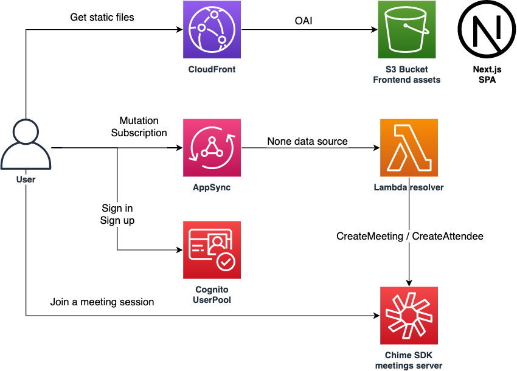
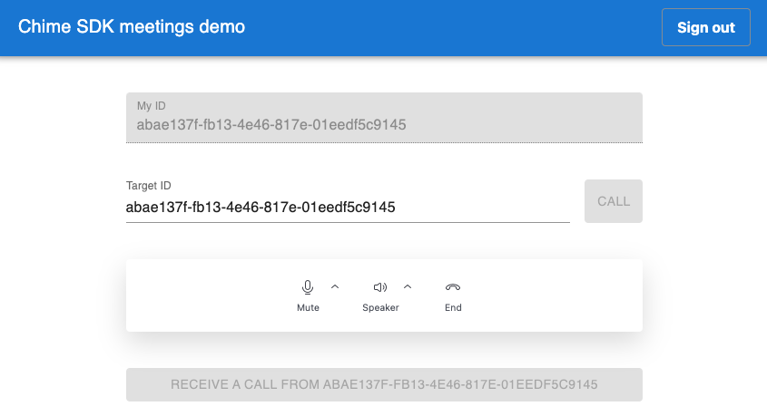
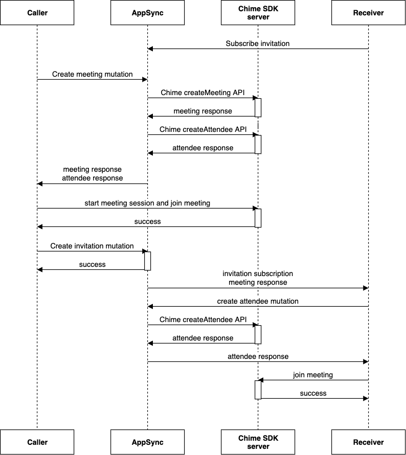

# Chime SDK Meetings 1on1 call demo with Next.js / AppSync / CDK
[](https://github.com/aws-samples/chime-sdk-meetings-demo-nextjs-appsync-cognito-cdk/actions/workflows/build.yml)

This is a sample project to demonstrate [Chime SDK meetings](https://docs.aws.amazon.com/chime-sdk/latest/dg/mtgs-sdk-mtgs.html) for one-on-one call with [Next.js](https://nextjs.org/), [AWS AppSync](https://aws.amazon.com/appsync/), [Amazon Cognito](https://aws.amazon.com/cognito/) and [AWS Cloud Development Kit (CDK)](https://github.com/aws/aws-cdk). 

This sample includes:

* 1on1 call with authN/Z leveraging Chime SDK meetings 
* GraphQL endpoint to call Chime SDK APIs and subscribe calling events
* Secure your backend API with JWT authentication
* Next.js frontend assets distribution via [CloudFront](https://aws.amazon.com/cloudfront/)
* Instant deployment of the entire app by a single command

## Architecture Overview



We use AppSync, a managed GraphQL service for backend API, enabling a realtime notification when a user is called, and other serverless services to reduce heavy lifting of managing servers.

### How to use
When you open this web app, you need first to sign up a Cognito user. After sign in to the user, a page like the below image will be shown.



The top text box shows your Cognito user ID, which is used as a kind of a "phone number" in this sample. When you call to a user, you must specify a target's user ID in the next text field. 
When you input the target user ID and click the `CALL` button, a meeting is created and the target user is notified. 

If the target user clicked the `RECEIVE A CALL` button, they will also join the meeting and can start a one-on-one call.

You can also specify audio devices via the Chime control panel.

## Deploy
You need the following tools to deploy this sample:

* [Node.js](https://nodejs.org/en/download/) (>= v16)
* [Docker](https://docs.docker.com/get-docker/)
* [AWS CLI](https://docs.aws.amazon.com/cli/latest/userguide/getting-started-install.html) and a configured IAM profile

Then run the following commands:

```sh
npm ci
npx cdk bootstrap
npx cdk deploy
```

Initial deployment usually takes about 10 minutes. You can also use `npx cdk deploy` command to deploy your changes.

After a successful deployment, you will get a CLI output like the below:

```
 ✅  ChimeSdkDemoStack

✨  Deployment time: 324.9s

Outputs:
ChimeSdkDemoStack.AuthUserPoolClientId8216BF9A = xxxxxxxxxxxxxxx
ChimeSdkDemoStack.AuthUserPoolIdC0605E59 = ap-northeast-1_yyyyyy
ChimeSdkDemoStack.BackendApiBackendApiUrl4A0A7879 = https://zzzzzz.appsync-api.ap-northeast-1.amazonaws.com/graphql
ChimeSdkDemoStack.FrontendDomainName = https://vvvvvvvv.cloudfront.net
Stack ARN:
arn:aws:cloudformation:ap-northeast-1:123456789012:stack/ChimeSdkDemoStack/1111
```

Opening the URL in `FrontendDomainName` output, you can now try the sample app on your browser.

## How it works
Here is a sequence diagram for starting a call. You can refer to [the official documents](https://docs.aws.amazon.com/chime-sdk/latest/dg/create-mtgs.html) for further details.



## Clean up
To avoid incurring future charges, clean up the resources you created.

You can remove all the AWS resources deployed by this sample running the following command:

```sh
npx cdk destroy --force
```

## Security
See [CONTRIBUTING](CONTRIBUTING.md#security-issue-notifications) for more information.

## License
This library is licensed under the MIT-0 License. See the LICENSE file.
